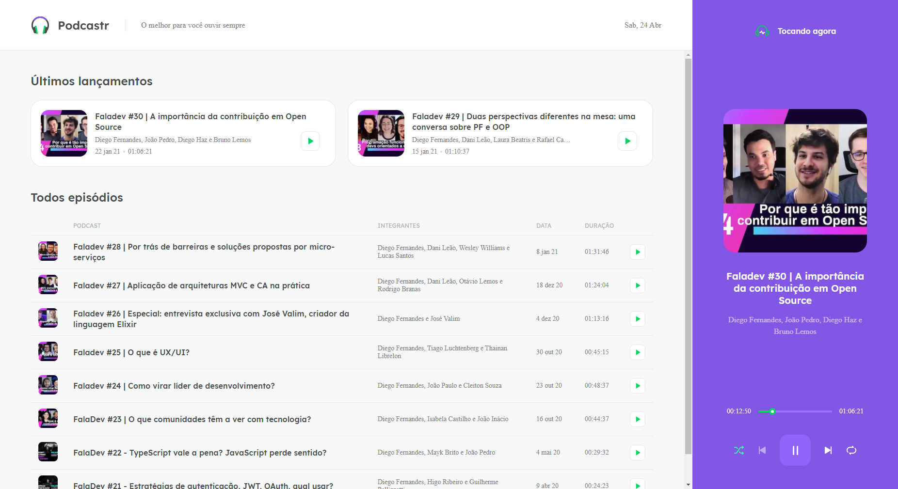

 <h1 align="center">Podcastr</h1>

<p align="center">
  <a href="https://github.com/othneildrew/Best-README-Template">
    
  </a>
</p>

<!-- ABOUT THE PROJECT -->
## Sobre o projeto

<p align="center">
    
</p>

Você pode ouvir todos os podcastr na Rocketseat através do player, com modo aleatório, repetição, player da lista ou tocar um único podcastr

### Recursos usados

* [Typescript](https://www.typescriptlang.org/)
* [React.js](https://pt-br.reactjs.org/)
* [Next.js](https://nextjs.org/)
* [Node.js](https://nodejs.org/en/)
* [JSON](https://www.json.org/json-en.html)
* [SASS/SCSS](https://sass-lang.com/documentation/syntax)


## Iniciando o Projeto

### Prérequisitos

Instale o npm no seu terminal
* npm
  ```sh
  npm install npm@latest -g
  ```

### Instalação

1. Execute ``` npm install ``` ou ``` yarn install ``` para instalar as dependências necessárias.
   ```sh
   npm install
   ```
2. Execute ``` npm start ``` ou ``` yarn start ``` e acesse no seu browser http://localhost:3000 para visualizar a aplicação.
   ```sh
   npm start
   ```

## Referências

Projeto idealizado por: https://github.com/Rocketseat
